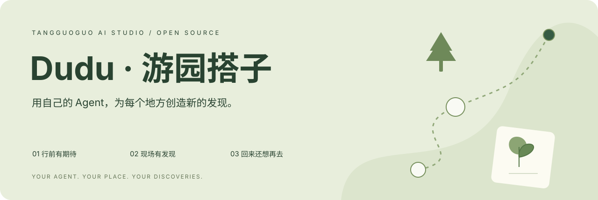
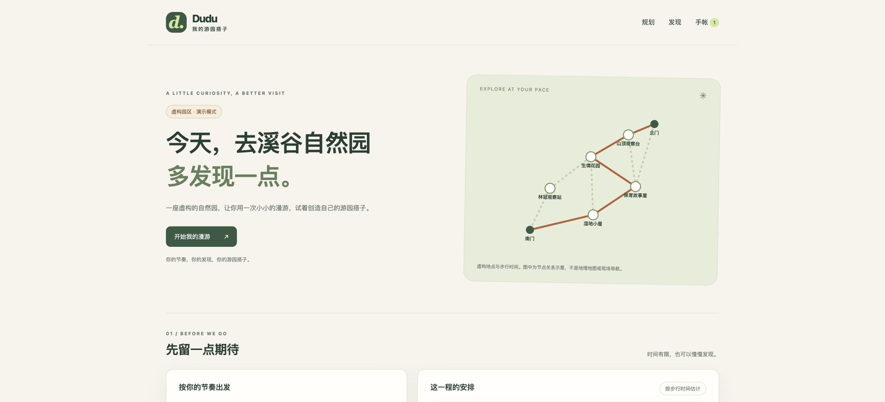

<div align="center">

# Dudu · 游园搭子 Skill

**行前有期待，现场有发现，回来还想再去。**

让每个人都能用自己的 Agent，为不同地方构建自己的游园搭子。

[红山在线体验](https://tggai.cn/hongshan-guide/) · [快速开始](#快速开始) · [下载 Skill](https://github.com/xychendave/dudu-guide-skill/releases/latest) · [安装 Skill](#把它交给你的-agent) · [共建指南](CONTRIBUTING.md) · [English](README.en.md)



</div>

## 这是什么

Dudu 是糖果果 AI 工作室从「红山 Dudu 游园」中提炼的一套开源方法与 Agent Skill。你可以把它交给自己的 Agent，整理一个地方的可信资料、规划行程、设计现场观察、回答追问，最后把自己的发现收进手帐。

它适合动物园，也可以迁移到植物园、博物馆、自然公园和展览。每个地方的内容不一样，但好的陪伴有相通之处：**帮助人注意到值得发现的东西，留出自己的节奏，也尊重眼前的生命与环境。**

仓库同时提供一个可运行的本地工作台。无需 API Key，无需 npm 安装依赖，先体验规划、到馆、观察与记录，再按需要接入自己的模型和服务。

> **当前版本：v0.1.0。** 开源范围是通用 Skill、原创方法文档、地点包格式、生成脚本与本地工作台。红山在线产品是起点和参考案例；这个仓库不是它的完整生产部署镜像。默认示例「溪谷自然园」为虚构园区，不可用于真实导航。网页内实时 AI 问答、语音、图片识别和共享动态需要另行接入。

## 从红山的一次游园开始

我们是糖果果和陈同学，B 站科技生活区创作者，也是糖果果 AI 工作室的成员。

四年前，我们一家去过一次动物园，对「逛动物园」留下了大致的印象。后来，我们带着自己做的游园搭子来到红山，收获了很不一样的体验：出发前开始期待某个场馆和故事；到了现场，除了找动物，也开始注意场馆、植物、遮蔽空间和保育工作；离开时，想把这些发现记下来，还想再来一次。

这次经历让我们认识了「丰容」这个词，也把它借作产品愿景：**AI Dudu 能不能丰容大家的游园体验？**

有时，期待中的动物正在休息，没有出现在游客视野里。落差是真实的。但一个场馆的设计、一个个体的来历、一项保育工作，以及动物可以选择躲藏和休息的空间，也值得被看见。Dudu 希望帮助游客打开这些宝藏，同时保留动物自己的节奏。

这是一组来自创作者亲身经历的产品观察，不代表效果研究或游客满意度统计。完整设计过程见 [红山案例](docs/hongshan-case-study.md)。

## 一个搭子，陪你走完三段体验

| 时刻 | 游客可能会说 | Dudu 帮什么忙 |
| --- | --- | --- |
| 行前 | 「第一次来，只有三小时，从南门进去。」 | 把入口、时间、兴趣转换成可执行路线，解释取舍 |
| 到馆 | 「我到这里了，有什么值得看？」 | 先说一点有来源的故事，再给一个现场观察入口 |
| 追问 | 「这个场馆为什么这样设计？」 | 让 Agent 基于当前资料回答，区分事实与未知 |
| 中途 | 「这里太精彩了，只剩一小时。」 | 从当前位置重排，保留出口路程和缓冲 |
| 没遇见 | 「想看的动物没有出现。」 | 转向生境、展板、保育故事与安静观察 |
| 游后 | 「把今天的发现做成我的手帐。」 | 整理真实记录，留下下次想再来的理由 |

「主动」可以从一个很小的交互开始：点击「我到了」，就给出一段适合此刻的内容。自动定位是可以扩展的触发方式，不是本地模板已经默认开启的能力。

## 快速开始

需要 **Node.js 20+** 和 Git。下面命令在 macOS/Linux 终端中运行；Windows 可使用 Git Bash，或在 PowerShell 逐条运行同样的 `git` / `node` 命令。

```bash
git clone https://github.com/xychendave/dudu-guide-skill.git
cd dudu-guide-skill

# 创建一个独立工作台；不会覆盖已有目录
node skills/dudu-guide/scripts/dudu.mjs init --output output/my-park

# 启动只在本机开放的预览
node skills/dudu-guide/scripts/dudu.mjs serve --dir output/my-park
```

打开 **[http://127.0.0.1:4173](http://127.0.0.1:4173)**。

试着走一遍：选择 120 分钟 → 生成路线 → 点击「我到了」→ 看一个观察提示 → 选择「暂时没看见」→ 写一条笔记 → 导出手帐。再把剩余时间改成 45 分钟，从当前位置重新规划。



<details>
<summary>查看手机宽度下的工作台</summary>


</details>

点击「复制问题与资料」，粘贴到自己的 Agent，就能带着来源继续追问。**工作台展示的是地点包里的资料卡，AI 对话由你使用的 Agent 完成。**

运行校验与测试：

```bash
node skills/dudu-guide/scripts/dudu.mjs validate --pack output/my-park/pack.json
npm test
```

本地模板不依赖第三方 npm 包，`npm test` 只是运行 Node 内置测试工具。更完整的命令、数据备份和常见问题见 [使用指南](docs/getting-started.md)。

本版本的验证范围和仍未覆盖的环境见 [验证记录](docs/validation.md)。

## 把它交给你的 Agent

### 直接读取，不必先安装

让能读取本地文件、运行命令的 Agent 打开仓库，然后说：

```text
请阅读 skills/dudu-guide/SKILL.md。
用这个 Skill，帮我为一个自然公园构建游园搭子。
先用演示工作台验证体验，再根据我提供的官方资料替换地点、路线和故事。
```

### 安装到 Codex

在仓库根目录运行，若目标已经存在，应先比较版本：

```bash
mkdir -p "$HOME/.codex/skills"
test ! -e "$HOME/.codex/skills/dudu-guide" && cp -R skills/dudu-guide "$HOME/.codex/skills/dudu-guide"
```

在新的会话中调用：

```text
使用 $dudu-guide，帮我做一个植物园游园搭子。
我想用两个小时，从南门进入，重点观察植物与环境的关系。
请先列出需要核实的资料，再生成可以在本机打开的工作台。
```

本 Skill 采用 `SKILL.md`、`scripts/`、`references/`、`assets/` 的目录形式，参照 [Agent Skills 格式规范](https://agentskills.io/specification)。其他兼容客户端按各自的 Skill 安装方式导入 `skills/dudu-guide`；不支持自动发现的客户端，可以显式读取该文件。这里没有宣称每个 Agent 都经过实测，实际能力取决于文件、命令与浏览器工具是否可用。

## 做出自己的版本

**最小改造单位是一个地点包。** 在生成目录中编辑 `pack.json`，或准备新包后生成：

```bash
node skills/dudu-guide/scripts/dudu.mjs validate --pack examples/your-place/pack.json
node skills/dudu-guide/scripts/dudu.mjs init --pack examples/your-place/pack.json --output output/your-place
```

上面的 `examples/your-place/pack.json` 是你需要自己创建的文件；仓库不预置这个真实地点。

你需要整理四类内容：

| 内容 | 示例 | 为什么需要 |
| --- | --- | --- |
| 地点 | 入口、出口、场馆、展区 | 知道在哪、往哪里去 |
| 连接 | 实际步行路径、估计时间、是否已核实无障碍 | 规划可以走的路线 |
| 知识 | 官方链接、核验日期、场馆事实 | 回答能追到来源 |
| 体验 | 观察任务、没看见时的替代建议 | 把信息变成现场收获 |

`--name` 只改显示名称，不会自动研究真实地点。真实地点必须替换资料与连接，不能把演示坐标和步行时间直接换个名字使用。

详见 [地点包规范](skills/dudu-guide/references/place-pack.md)、[构建流程](skills/dudu-guide/references/build-workflow.md) 与 [迁移到不同地点](docs/adapting-to-new-places.md)。

## 可信的知识如何进入讲解


每条个体故事应有对应来源。历史新闻不能当成动物今天的状态，转写也需要核验名字、数字和时间。资料没有答案时，Dudu 应当说清不知道的部分，而不是用一般常识补出某个园区的故事。

红山产品的设计使用了场馆宣教资料及官方内容；介绍中提到的 B 站视频整理，是可复用的知识构建思路。本开源版本没有附带通用视频抓取和转写器，也没有把第三方原始视频、地图与完整讲解稿重新分发。完整流程见 [知识库方法](skills/dudu-guide/references/knowledge-pipeline.md)。

## 当前能用什么

| 能力 | 本地开源模板 v0.1 | 红山参考与后续扩展 |
| --- | --- | --- |
| 路线规划 / 中途调整 | 可运行；步行图 + 时间预算 + 出口缓冲 | 可进一步加入开放时间与动态条件 |
| 到馆资料 / 观察提示 | 可运行；用户手动触发 | 可扩展定位或扫码触发 |
| 基于资料追问 | 复制上下文给自己的 Agent | 红山线上有模型问答接口；模板不内置 |
| 没看见时的替代体验 | 可运行 | 可按动物园、博物馆等场景改写 |
| 打卡 / 手帐 / 导入导出 | 可运行；文字、本地存储 | 可扩展照片、识别、分享模板 |
| 共享观察 / 参考热度 | 未内置 | 红山线上有相关流程；热度是估计，不是实测人数 |
| 语音 / 图片识别 | 未内置 | 需模型服务、密钥与相应数据处理 |
| 自动视频采集与转写 | 方法文档 | 需宿主 Agent 的可用工具和素材处理权限 |

路线算法不保证全局最优；示意图不等同于 GIS 导航；不开启 GPS，不会自动知道你在哪。详细技术说明见 [架构](skills/dudu-guide/references/architecture.md)。

## 我的数据和 Token 去哪了

- **本地工作台**：地点包在本机，个人记录保存在当前浏览器；无账号、无统计脚本、无默认上传。
- **自己的 Agent**：用自己的模型配置和计费方式。复制资料后发送到云端 Agent，内容会进入相应服务。
- **完全本地推理**：只有相关模型、处理和存储都在本机，且没有启用远程请求时才成立。
- **社区分享**：默认不共享个人笔记、照片和位置。是否分享、分享哪些内容，由你决定。

所以我们说的是「使用者掌握模型与数据的选择」，而不是承诺「装了 Skill，所有信息就永远不离开电脑」。见 [隐私与数据流](docs/privacy.md)。

## 仓库导航

```text
dudu-guide-skill/
├── README.md / README.en.md        项目介绍与快速开始
├── skills/dudu-guide/
│   ├── SKILL.md                   Agent 入口
│   ├── agents/openai.yaml         Codex 展示信息
│   ├── scripts/dudu.mjs            生成、校验、本机服务
│   ├── references/                构建、陪逛、知识库、格式、架构
│   └── assets/
│       ├── demo-park.json          原创虚构园区
│       └── workbench/              可复用的前端与路线逻辑
├── examples/hongshan/              红山迁移简报与验收场景
├── docs/                          案例、使用、隐私、迁移、路线图
├── tests/                         路线、数据边界与 CLI 验证
└── .github/                       CI 与社区反馈模板
```

## 一起共建

不只欢迎写代码的人。你也可以贡献一条有来源的场馆故事、一次实地路线纠错、一个更有趣的观察任务，或者一款手帐模板。

可以从这些方向开始：

- 为你熟悉的地方整理小型地点包，注明来源与检查日期。
- 记录实际步行时间，修正不准确的路径或无障碍标记。
- 测试「没看见动物」时的体验，让发现不只依赖打卡。
- 改进界面可访问性、语言表达和移动设备体验。
- 用自己的 Agent 试用 Skill，提交完整复现方式与期望结果。

提交前请阅读 [CONTRIBUTING.md](CONTRIBUTING.md)。计划中的工作见 [路线图](docs/roadmap.md)；问题可在 [Issues](https://github.com/xychendave/dudu-guide-skill/issues) 中提出。

## 开源许可与致谢

本仓库的原创代码、Skill、文档与虚构示例按 [MIT License](LICENSE) 发布。园区品牌、第三方地图、视频、照片、讲解稿与外部链接内容不因本仓库开源而获得重新授权。具体边界见 [素材与来源说明](docs/attribution.md)。

感谢红山带来的观察与启发，也感谢关心动物福利、保育与公众教育的人们。Dudu 是糖果果 AI 工作室的创作项目；本仓库不代表园方官方发布或背书。

**希望每个地方，都能长出属于它的游园搭子。**
